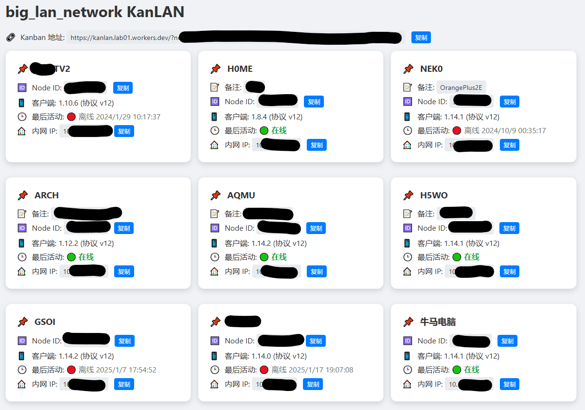

# KanLAN

KanLAN (aka Kanban LAN) 是基于Cloudflare Worker和ZeroTier API的看板小工具，用于与朋友ZeroTire联机游戏互查IP，或者快速查看自己局域网的设备（免于每次登入ZeroTier）



## 如何部署？

下载本项目然后
```
pnpm install
pnpm run deploy
```

## DEMO

! 建议部署自己的KanLAN，使用DEMO后建议重置Token

[KanLAN DEMO](https://kanlan.lab01.workers.dev/setup)
